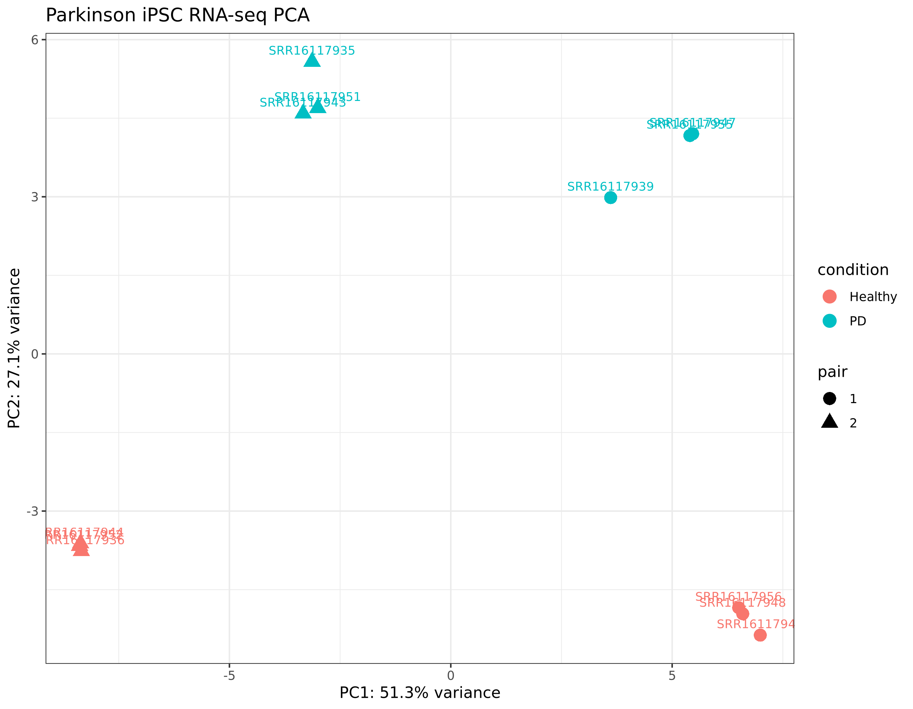
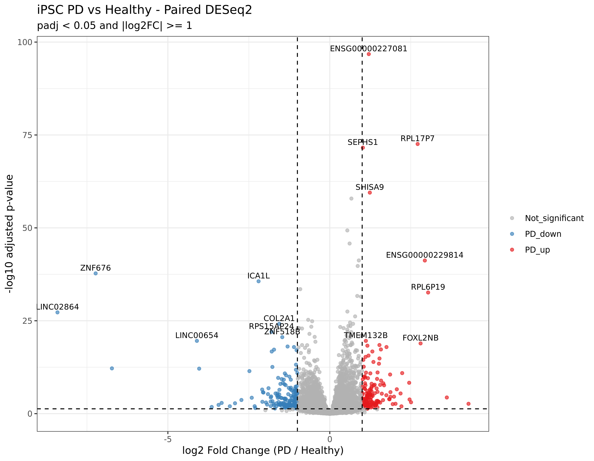
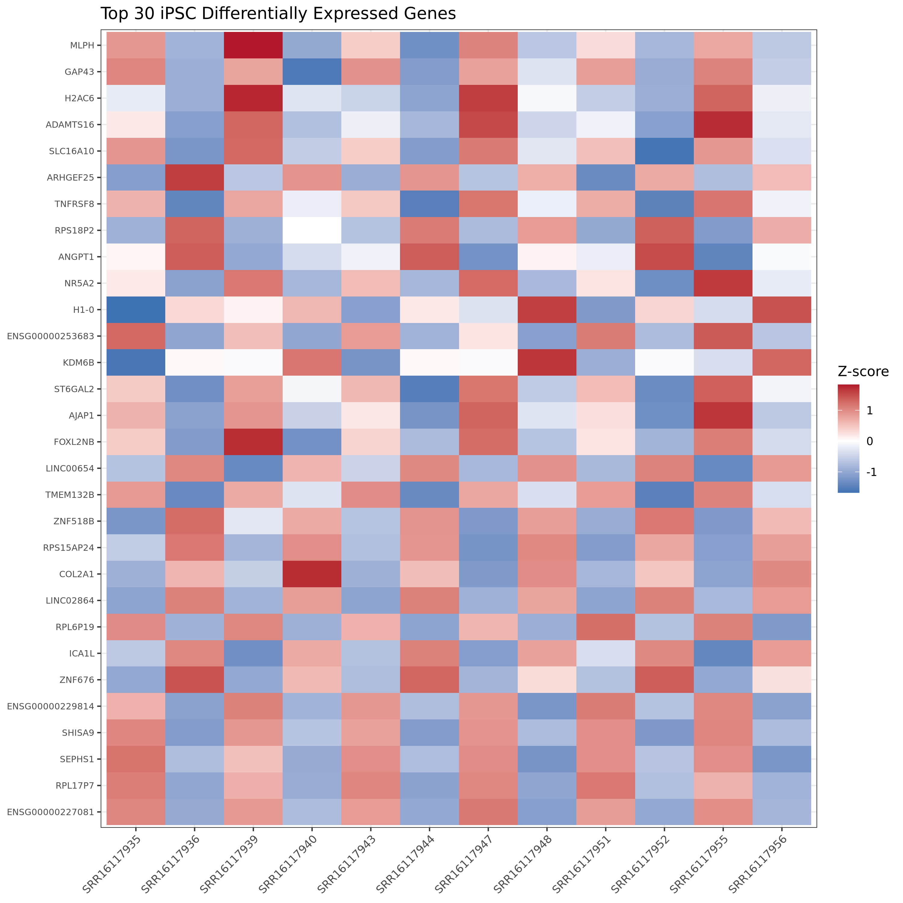
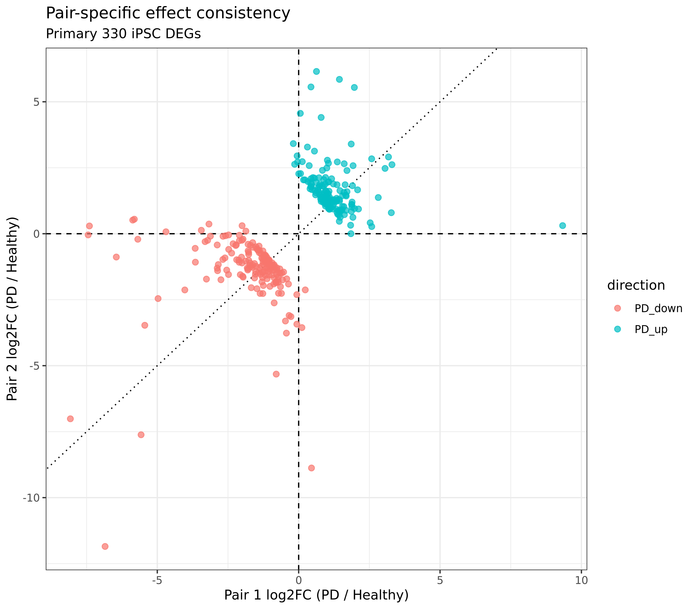
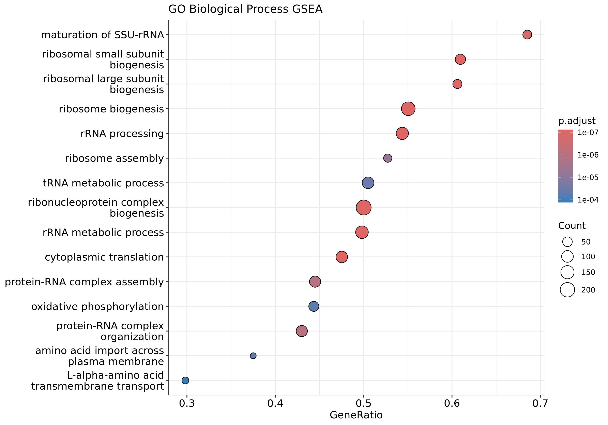
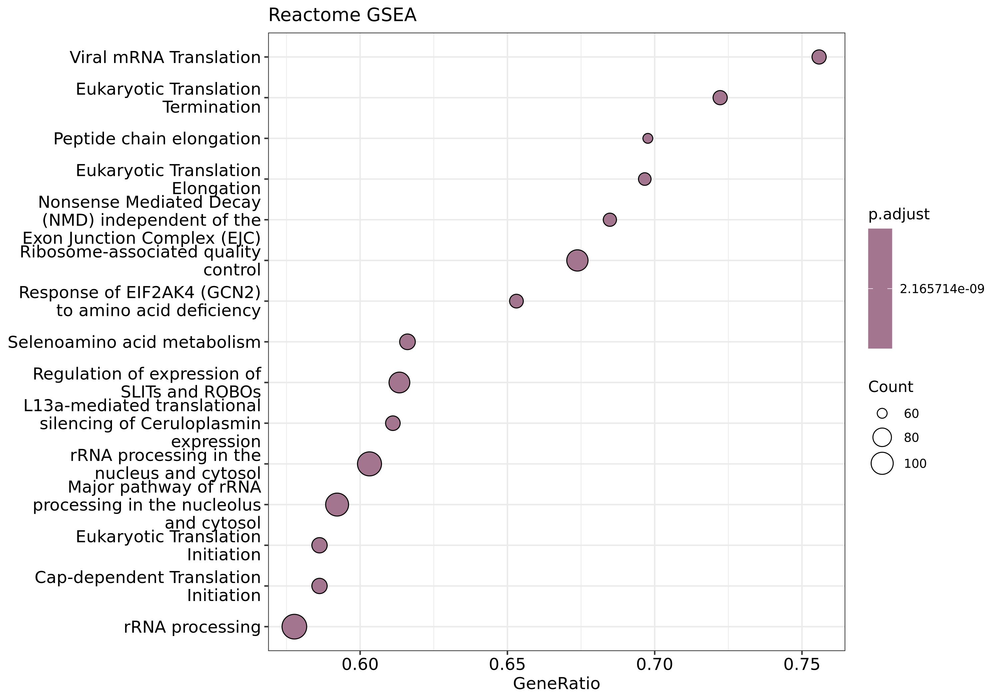
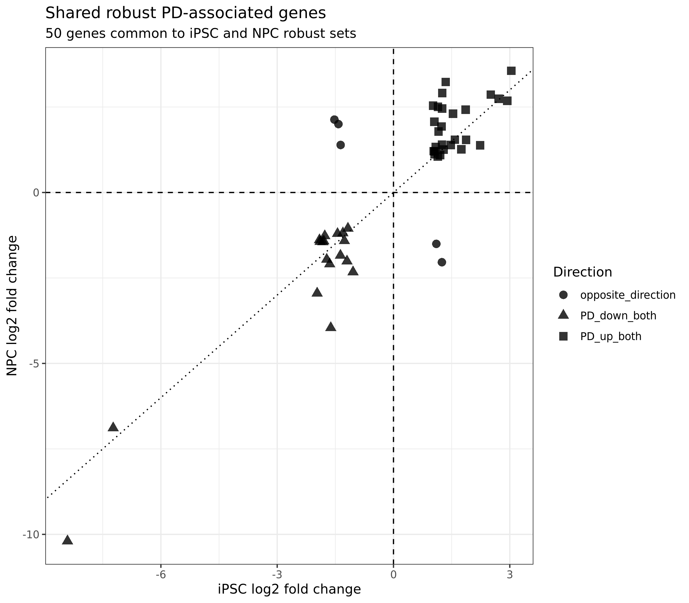

# Parkinson Disease iPSC RNA-seq Analysis

RNA-seq reanalysis of induced pluripotent stem cells (iPSCs) from discordant monozygotic twin pairs for Parkinson's disease.

Dataset: **GEO GSE185009**
Study: Vlasov et al. (2021), *Cells* 10(12):3478.

## Study design

- 12 iPSC RNA-seq libraries
- Two discordant monozygotic twin pairs
- Cell lines: 1B (PD), 1K (Healthy), 2B (PD), 2K (Healthy)
- Three within-line/culture replicates per cell line
- DESeq2 design: `~ pair + condition`

Positive log2FC indicates higher expression in PD-derived iPSCs.

## Workflow

`FASTQ -> FastQC -> HISAT2 -> featureCounts -> DESeq2 -> pair consistency -> GO/Reactome ORA + GSEA -> iPSC vs NPC comparison`

Reference: GRCh38, Ensembl release 92.
The data were treated as unstranded (`featureCounts -s 0`).

## Main results

- 58,395 genes before filtering
- 15,441 genes after filtering
- 330 significant DEGs
- 153 PD-up
- 177 PD-down
- 315/330 DEGs (95.5%) changed in the same direction across both twin pairs
- 263 genes formed the stricter robust iPSC core

### Main biological signals

**PD-up**
- Ribosome biogenesis
- rRNA processing
- Cytoplasmic translation
- Translation initiation, elongation and termination

**PD-down**
- Cilium assembly and organization
- Microtubule organization
- Centrosome and spindle biology
- Mitotic / chromosome-segregation programs

## iPSC vs NPC comparison

- iPSC robust genes: 263
- NPC robust genes: 1,066
- Shared robust genes: 50
- 45/50 (90%) changed in the same direction
- Shared robust-gene LFC correlation: 0.8794

Across 14,227 genes tested in both cell states:
- Global LFC correlation: 0.2992
- Same-direction percentage: 59.9%
- 891 genes had |LFC| >= 0.5 in both
- Strong-gene LFC correlation: 0.5508
- Strong genes same direction: 74.4%

These results suggest substantial cell-state-specific transcriptional effects together with a smaller, highly concordant shared PD-associated core.

## Key figures

### PCA

### Volcano plot

### Top 30 DEG heatmap

### Pair consistency

### GO GSEA

### Reactome GSEA

### Shared robust iPSC-NPC genes

## Repository structure

- `metadata/` - sample metadata
- `scripts/` - analysis scripts (01-14)
- `results/` - selected QC, differential expression, enrichment and comparison outputs
- `runs.txt` - SRA run accessions
- `environment.yml` - conda environment
- `.gitignore` - excludes FASTQ, BAM, reference files and large intermediates

## Limitations

The study contains only two independent twin pairs. Replicates increase within-line measurement precision but are not independent patients. Results should therefore be interpreted as exploratory and dataset-specific rather than as a population-level Parkinson's disease signature.

The iPSC and NPC robust sets were generated with related but not perfectly identical robustness definitions, so their direct overlap should be interpreted cautiously.

## Data

GEO accession: **GSE185009**
